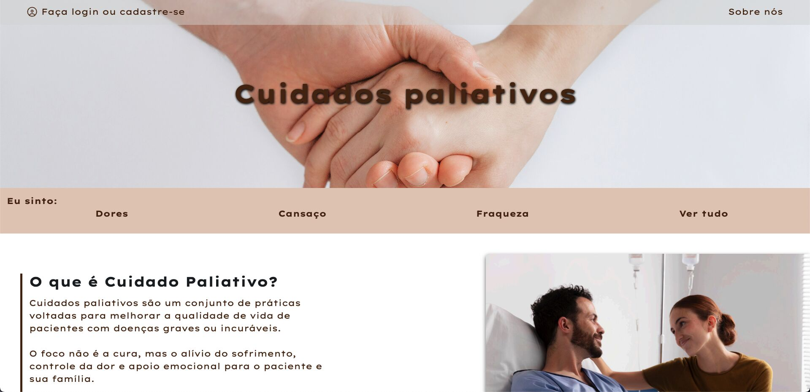
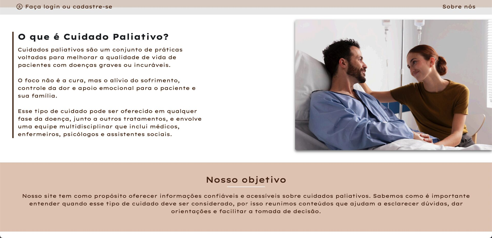
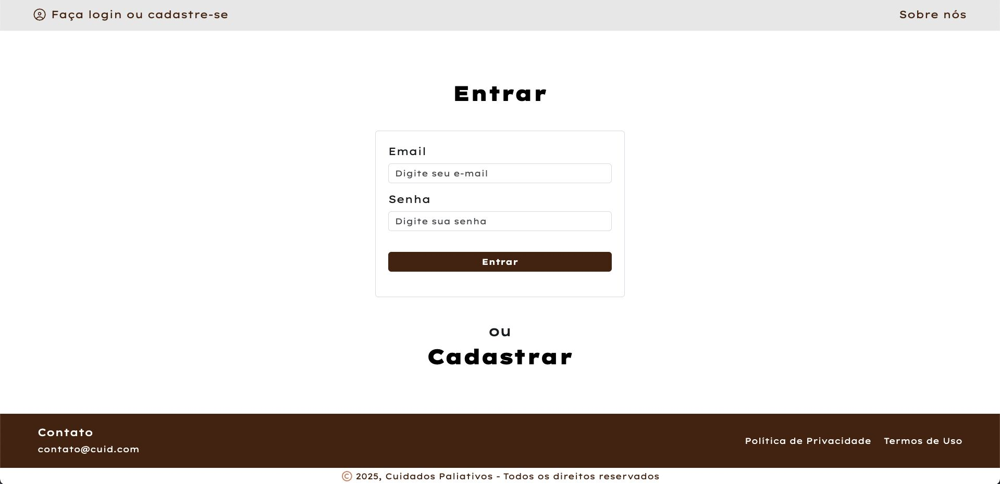
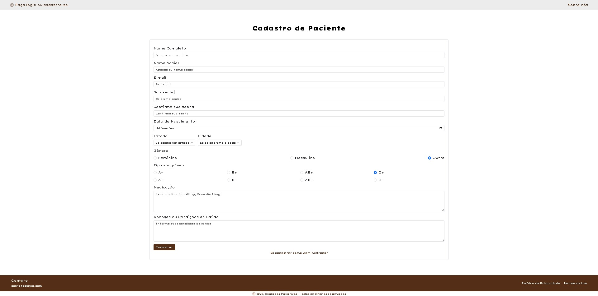
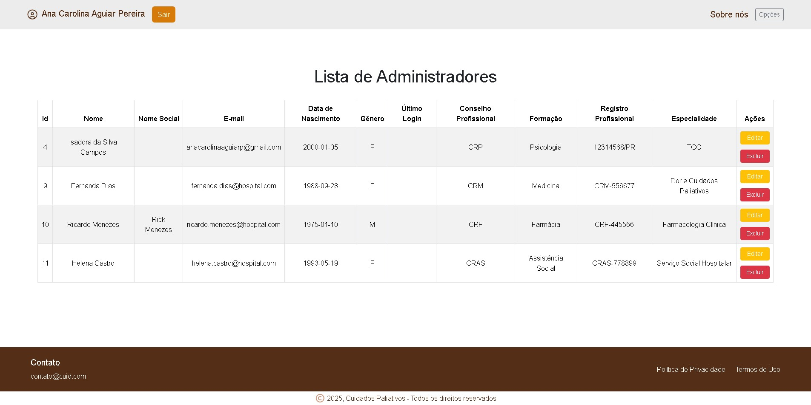

# Projeto Acadêmico - PaliVida  (em andamento) 👩‍💻
Este projeto marca a integração prática de todos os conhecimentos adquiridos ao longo do 3º semestre do curso, unindo as disciplinas de Desenvolvimento de Sistemas, Desenvolvimento de Software e Tópicos Especiais de Sistemas.

Seu principal objetivo é proporcionar aos alunos uma experiência próxima à realidade do mercado, desenvolvendo um sistema completo que simula os desafios enfrentados no dia a dia de um(a) desenvolvedor(a). Ao longo do processo, os estudantes são estimulados a aplicar conceitos de arquitetura de software, programação orientada a objetos, integração entre tecnologias, boas práticas de codificação e organização de projetos.

## Estrutura do Projeto 📁
```
projeto/
├── API/                           # Backend com Node.js e Express
│   ├── .gitignore
│   ├── package.json
│   ├── package-lock.json
│   └── src/
│       ├── controllers/           # Lógicas de controle da API
│       │   └── index.js
|       |
│       ├── models/
│       │   └── DAO/               # Acesso ao banco (DAOs e conexão)
|       |
│       └── views/                 # Views EJS utilizadas pela API
|
├── PHP/                           # Interface do sistema em PHP (MVC)
│   ├── controller/                # Controladores das rotas e ações
|   |
│   ├── dao/                       # Acesso a dados e conexão
|   |
│   ├── model/                     # Modelos das entidades do sistema
|   |
│   └── view/                      # Interfaces do usuário (HTML + CSS + PHP)
|
└── sql/                           # Script de criação do banco de dados
```

## Tecnologias Utilizadas
 * **Node.js** (Express)  
 * **PHP**  
 * **HTML5**  
 * **CSS3**  
 * **Bootstrap**  
 * **JavaScript**  
 * **MySQL**

---

## Telas do Projeto

### Tela Inicial



### Tela de Login


### Tela de Cadastro do Paciente


### Listagem de Usuários


### Listagem de Conteúdo


### Listagem de Administradores
